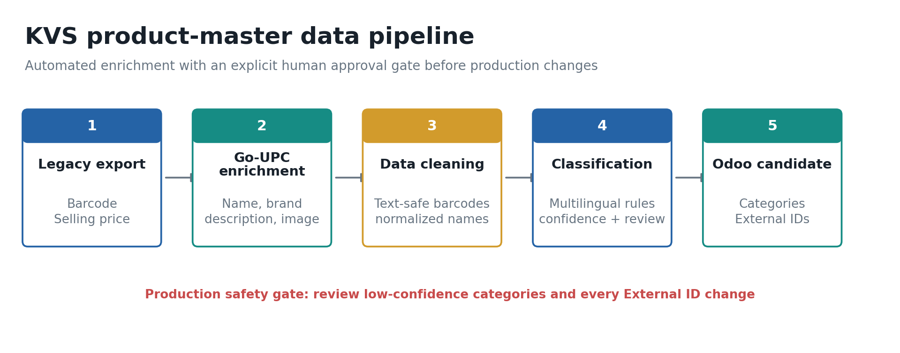

# 01 - Product Data Pipeline

The legacy grocery POS export contained approximately 8,000 entries, including duplicate barcodes, repeated products, broken names, inconsistent pack sizes, and unreliable categories. Barcode and selling price were the only consistently useful fields, so barcode became the stable key for rebuilding product identity. Deduplication, consolidation, enrichment, and review reduced the source to an approved catalog of 2,872 clean products, or roughly 3,000 usable records. The pipeline queried 3,616 barcode candidates through the Go-UPC API, received 2,947 successful product responses, and obtained image URLs for 2,876 products - approximately 2,800 enriched records ready for catalog work. A second Python stage normalized multilingual Indian, wider Asian, and African product names, applied a controlled retail taxonomy, and generated deterministic Odoo External IDs.

## Results

| Measure | Result |
|---|---:|
| Approximate entries in the legacy POS export | ~8,000 |
| Unique barcode candidates sent through the enrichment workflow | 3,616 |
| Successful Go-UPC product responses | 2,947 (81.5%) |
| Go-UPC records not found | 662 |
| API or barcode-format errors | 7 |
| Product image URLs returned | 2,876 (79.5%) |
| Products in the approved Odoo workbook | 2,872 |
| Approved products with a nonblank barcode | 2,723 (94.8%) |
| Main inventory categories | 20 |
| Duplicate nonblank barcodes in the approved workbook | 0 |
| Duplicate External IDs in the approved workbook | 0 |
| Products left in an `Unknown` category | 0 |
| External ID/reference changes applied and verified during migration | 806 |
| Approved products matched in the final Odoo read-back | 2,864 |
| Identifier conflicts held back for manual resolution | 8 |

The figures above are measured from the retained enrichment output, approved workbook, and migration verification records. The approximately 8,000-entry starting point is the business-reported size of the original POS export before duplicate and quality reduction.

## Architecture



```text
Legacy POS export
      |
      | exact, text-safe barcode extraction
      v
Go-UPC enrichment --------> resumable CSV + run summary
      |
      | exact barcode join
      v
Name normalization --------> multilingual matching text
      |
      v
Rule engine + overrides ---> inventory, POS, and website categories
      |
      v
External ID allocator -----> review workbook + import candidate + ID map
      |
      v
Human approval and controlled Odoo import
```

### Stage 1: barcode enrichment

`scripts/01_go_upc_enrich.py` reads barcodes from CSV or Excel and requests product name, brand, description, ingredients, image URL, source category, and barcode type. It preserves leading zeroes, rejects scientific-notation barcodes, supports optional GTIN check-digit validation, retries temporary failures, respects API rate limits, resumes interrupted jobs, and writes each completed result immediately.

### Stage 2: multilingual catalog build

`scripts/02_build_odoo_catalog.py` joins source and enrichment data by exact barcode, cleans display names, transliterates text for matching while retaining the original text, and evaluates configurable category rules. Specific product forms and strong market identity are evaluated before broad words, preventing cases such as `gin` matching `ginger`, `rum` matching `drumstick`, or a product brand containing `Fresh` being treated as produce. Exact business exceptions remain visible in `examples/manual_overrides.csv` instead of being hidden in Python code.

The builder validates all proposed categories against the taxonomy workbook, derives POS and website categories, preserves valid identifiers, and allocates new External IDs deterministically. It produces separate review, import, and identifier-map artifacts; it does not connect to or modify Odoo.

## Usage

### 1. Install

Python 3.10 or newer is recommended.

```bash
python -m venv .venv
python -m pip install -r requirements.txt
```

Activate the environment using the command for your operating system, then provide the API key through the environment. The scripts never read a key from source code.

```bash
export GO_UPC_API_KEY="your-key"
```

Windows PowerShell equivalent:

```powershell
$env:GO_UPC_API_KEY = "your-key"
```

`.env.example` documents the required variable. Do not commit a populated `.env` file.

### 2. Enrich barcodes

The input needs a barcode-like column named `barcode`, `EAN`, `GTIN`, or `UPC`. Start with a small run to confirm the account, input, and remaining API allowance.

```bash
python scripts/01_go_upc_enrich.py \
  --input examples/barcodes.csv \
  --output output/go_upc_products.csv \
  --summary output/go_upc_summary.json \
  --limit 10
```

Useful options:

- `--validate-check-digit` rejects invalid GTIN check digits before lookup.
- `--overwrite` starts a fresh output; the default resumes completed work.
- `--keep-errors` retains previous errors instead of retrying them.
- `--save-raw-json` stores successful raw responses for an audit trail.
- `--delay 0.55` uses the conservative default for Go-UPC's current two-request-per-second limit.

### 3. Build the catalog

The product source needs barcode, name, External ID, main category, and product category columns. The taxonomy workbook needs an `Inventory Categories` sheet containing Main Category, Code, Rank, and Sub Category fields.

```bash
python scripts/02_build_odoo_catalog.py \
  --products data/legacy_products.xlsx \
  --enrichment output/go_upc_products.csv \
  --taxonomy data/product_categories.xlsx \
  --rules config/classification_rules.json \
  --mappings config/channel_mappings.json \
  --overrides examples/manual_overrides.csv \
  --output-dir output/catalog
```

Generated artifacts:

| File | Purpose |
|---|---|
| `catalog_review.xlsx` | Every classification decision, confidence, rule, and before/after category |
| `catalog_import_candidate.xlsx` | Non-Unknown products proposed for import |
| `external_id_change_map.csv` | Exact old/new identifier mapping and suggested display name |
| `run_summary.json` | Counts, duplicate checks, and review totals for audit or CI |

Use `--keep-source-names` when enriched names should fill blanks rather than replace legacy names. For updates to products already present in Odoo journal entries, `--omit-column Unit` avoids proposing a Unit of Measure update when none is intended.

### 4. Review and test

```bash
python -m unittest discover -s tests -v
```

Review every row marked `Review Required`, every category movement, and every External ID change before import. Preserve current Odoo exports as rollback evidence and validate a small batch by exact barcode and product name before a wider production update.

## Configuration

- `config/classification_rules.json` contains prioritized multilingual category rules, exclusions, confidence, and human-readable reasons.
- `config/channel_mappings.json` maps inventory categories to POS and website categories.
- `examples/manual_overrides.csv` demonstrates owner-approved exact barcode or name exceptions.
- `examples/barcodes.csv` is a minimal public-product barcode input sample.

## Documentation

The illustrated [Product Data Engineering Report](docs/KVS_Product_Data_Engineering_Report.pdf) records the project rationale, measured results, difficult classification examples, and production safeguards. It complements the wider case study's Odoo operations manual by documenting how the product master was engineered before daily purchasing, inventory, POS, website, lot, expiry, and replenishment workflows began.

## Publication boundary

This section contains no production workbook, supplier pricing, margins, costs, stock levels, sales transactions, customer details, credentials, or live Odoo access logic. The example files contain only publicly sold product names/barcodes and synthetic explanatory values. See `SECURITY.md` before publishing a fork or adapting the scripts to another environment.
