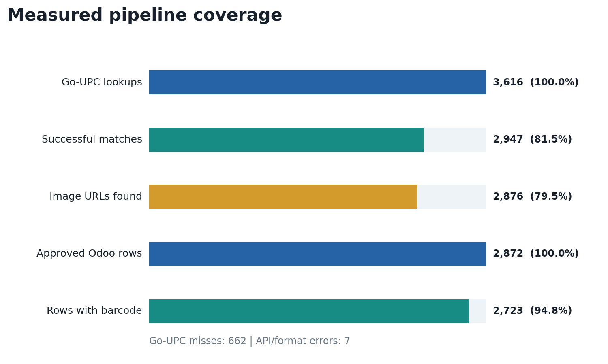
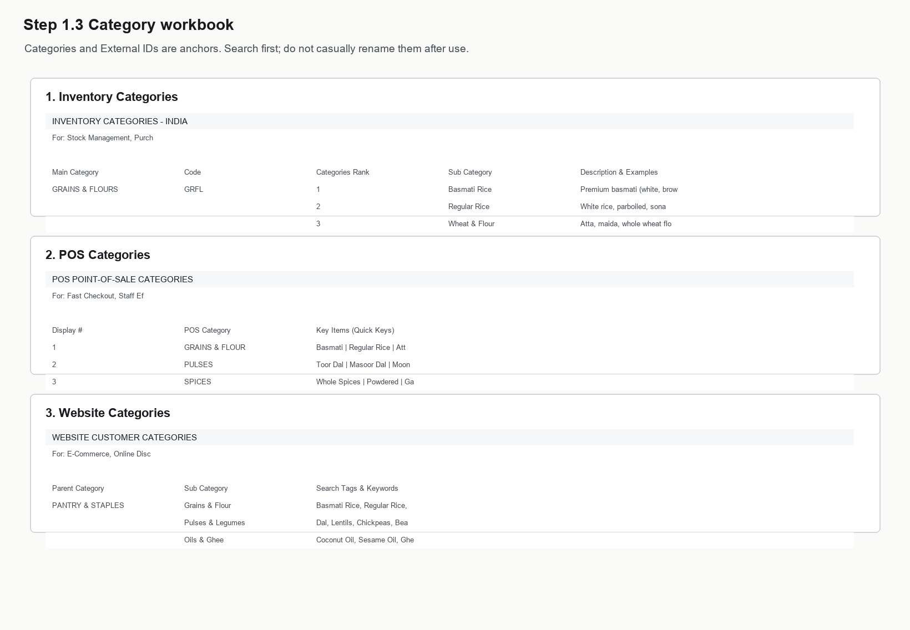
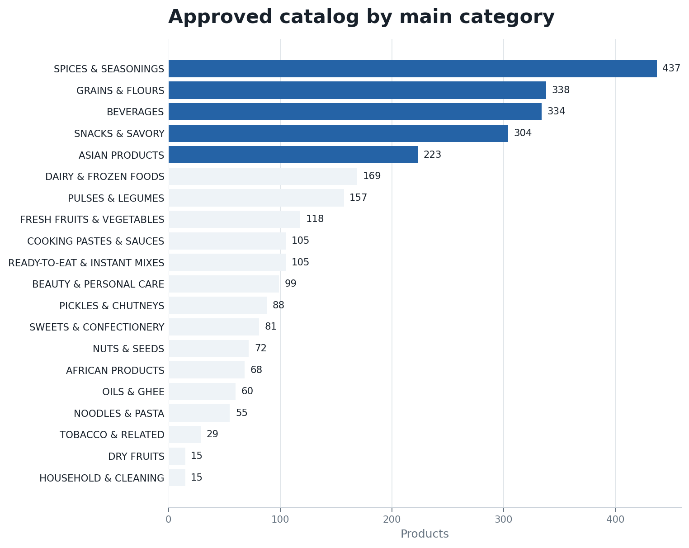

# KVS Product Master Data Engineering and Odoo Migration

**Portfolio project report**  
**Domain:** Grocery retail, product information management, data quality, Odoo Online  
**Project period:** May-June 2026  
**Companion document:** KVS Odoo Product Lifecycle Training Manual

## Executive summary

I transformed a legacy grocery product database into a structured, import-ready
Odoo product catalog. The old data had two dependable fields - barcode and
selling price - but product names were inconsistent, descriptions and images
were mostly missing, categories were unreliable, and product identifiers were
not suitable for controlled updates.

I designed a two-stage Python pipeline. The first stage uses barcode values to
retrieve product identity data from the Go-UPC API. The second stage cleans
multilingual product names, classifies products against a controlled KVS
taxonomy, derives POS and website categories, and assigns deterministic External
IDs. Human review remains a formal gate before any production change.

The approved workbook contains **2,872 products across 20 main categories**, with
**zero duplicate nonblank barcodes, zero duplicate External IDs, and zero
Unknown categories**. A separate operational manual then explains how staff use
the resulting records in Odoo for purchasing, inventory, lots, expiry, POS,
website sales, and replenishment.


## The original problem

The existing database could not be treated as a dependable product master. Its
short notes included inconsistent capitalization, abbreviations, partial pack
sizes, spelling errors, and multilingual supplier text. Categories were often
based on a single word rather than the real product and customer context. For
example, an African palm oil could be placed in the general Indian oil category,
while `Fresh` in a brand name could incorrectly send a packaged drink or frozen
paratha to fresh produce.

The migration therefore had four requirements:

1. Preserve the reliable commercial anchors: barcode and selling price.
2. Recover product identity at scale without manually researching thousands of
   barcodes.
3. Make classification precise enough for inventory, POS, website navigation,
   reporting, and stable External IDs.
4. Protect the live Odoo database with review files, exact matching, dry runs,
   and an explicit approval step.

## Stage 1 - barcode enrichment with Go-UPC

The first Python program reads a CSV or Excel barcode list and calls Go-UPC once
per unique product. It extracts name, brand, description, ingredients, image
URL, source category, and barcode type. Each request receives a durable status:
`ok`, `not_found`, `invalid_barcode`, or `error`.

The refined public script improves the original working version by adding:

- environment-only credential handling;
- preservation of leading zeroes and rejection of scientific notation;
- restart/resume behavior so API credits are not spent twice;
- retry and exponential backoff for rate limits and server errors;
- defensive flattening of multilingual API values;
- optional GTIN check-digit validation and raw JSON evidence;
- row-by-row output flushing and a machine-readable run summary.

The retained production lookup file records **3,616 barcode requests**. Go-UPC
returned useful product data for **2,947 products (81.5%)**, while **662 were not
found** and **7 returned API or barcode-format errors**. It returned **2,876
image URLs (79.5%)**. These figures also show why API enrichment cannot replace
data-quality review: a successful response is evidence, not proof that the
matched product is correct.



## Stage 2 - naming, multilingual classification, and IDs

The catalog builder joins legacy and enriched data by an exact text-safe
barcode. It forms a consistent `Brand Product Size` display name, normalizes
common packaging units, removes low-value marketing phrases, and preserves the
original multilingual source text in descriptions.

Classification uses Unicode normalization, case folding, accent removal, and
transliteration for matching. The decision order is deliberately asymmetric:
specific product forms and strong business identity are evaluated before broad
ingredient words. Single-word rules use boundaries, so `gin` does not match
`ginger` and `rum` does not match `drumstick`.

The rule engine is configuration-driven. Each JSON rule contains a priority,
target main/subcategory, confidence, positive terms, required terms, exclusions,
and a human-readable reason. Exact owner-approved exceptions live in a separate
CSV keyed by barcode, External ID, or normalized product name.

This structure handles the difficult cases found during review:

| Legacy or ambiguous product | Correct classification | Why |
|---|---|---|
| Guinea Fresh Palm Oil 1L | AFRICAN PRODUCTS / African Oils & Condiments | African market identity outranks generic oil |
| V-Fresh Pomegranate Juice | BEVERAGES / Soft Drinks & Juice | Fresh is part of the brand; juice is the product form |
| Fresh Drumstick (Moringa Pod) | FRESH FRUITS & VEGETABLES / Fresh Vegetables | Fresh plus a specific produce term |
| Ashoka Mixed Vegetable Paratha | DAIRY & FROZEN FOODS / Frozen Foods | Vegetable describes the filling, not the department |
| Horlicks Original Malted Drink | BEVERAGES / Other Drinks | Malted nutrition drink, not alcohol |
| Maliban Ginger Cookie | SNACKS & SAVORY / Baked Snacks | Cookie form outranks ginger ingredient |
| Annam Curry Leaves | SPICES & SEASONINGS / Dried Herbs | South Asian herb, not East/Southeast Asian specialty |
| Brown Sugar Jaggery Powder | SPICES & SEASONINGS / Other Seasonings | Cooking sweetener; no false grain/flour rank is invented |

## Controlled taxonomy and channel mapping

The category workbook defines the inventory hierarchy, category code, and rank.
The program validates every rule against this source before generating IDs. It
also maps inventory categories to the smaller POS navigation taxonomy and the
customer-facing website taxonomy.



This is important because the same product has different organizational needs:
inventory categories support purchasing and reporting, POS categories support
fast checkout, and website categories support customer discovery. A product is
not considered complete until those three views agree.

## External ID strategy

External IDs follow the pattern `CODE-NNNN`. The category code comes from the
main category, and the first digit of the numeric block represents the supplied
subcategory rank. For example, `ASIA-1003` belongs to the first Asian
subcategory block.

The generator preserves an existing ID only when its prefix and rank already
match the final category and the ID is unique. Otherwise it allocates the next
unused value inside the correct block. The review output records old ID, new ID,
product name, barcode, category movement, confidence, rule ID, reason, and a
suggested External Identifier display name.

After workbook approval, the live migration applied and verified **806 External
ID/reference changes**. A final read-back matched **2,864 products** to the
approved workbook. **Eight conflicts were intentionally held back** because the
target identifiers belonged to products outside the workbook. This is a useful
production outcome: the safety checks prevented a technically valid but unsafe
overwrite.

## Results

The final workbook contains:

- **2,872 product rows**;
- **20 main inventory categories**;
- **2,723 nonblank barcodes (94.8%)**;
- **2,872 names and External IDs**;
- **zero duplicate nonblank barcodes**;
- **zero duplicate External IDs**;
- **zero Unknown categories** after 18 unresolved products were intentionally
  removed for later manual creation;
- **2,738 unit-based products and 134 kg-based products**.



Representative before/after records show the change in data quality:

| Legacy note and category | Final product identity | Final category / ID |
|---|---|---|
| `Ching s secret dark soy Sauce` / generic sauces | Ching's Secret Dark Soy Sauce, Bottle 210g | Asian Sauces / `ASIA-1003` |
| `President` / Candy, Mints & Gum | President Rice Basmati Parboiled 10kg | Basmati Rice / `GRFL-1012` |
| `buldak black 140g*5 pk` / Candy, Mints & Gum | Samyang Buldak Original Hot Chicken Ramen | Asian Rice & Noodles / `ASIA-2028` |
| `white jaggery powder` / Candy, Mints & Gum | Marmite Jaggery Gur Cane Sugar 500g | Other Seasonings / `SPIC-5038` |

## Production safeguards and lessons learned

The project was performed against a live Odoo Online environment, where a wrong
External ID can update the wrong record and a Unit of Measure change can be
blocked after posted journal entries exist. The reusable scripts therefore stop
at file generation and never write to Odoo.

The practical safeguards were:

- exact barcode and exact name verification before an identifier change;
- no approximate-name production matching;
- separate review, import-candidate, and External-ID-map outputs;
- duplicate checks before import;
- deterministic ID allocation and conflict detection;
- dry-run/read-back verification around live changes;
- omission of the `Unit` column for update imports when no UoM change is intended;
- retention of unresolved products outside the import rather than assigning a
  false category.

One remaining limitation is description coverage. Every approved row has an
eCommerce Description cell, but **607 rows currently contain the placeholder
`No description found.`**. These records are valid for import, but product-page
copy should be improved as a separate content-quality project. Product images
also require licensing and visual verification before public website use.

## Relationship to the Odoo manual

This repository documents how the product master was created. The KVS Odoo
Product Lifecycle Training Manual begins where this project ends: it shows staff
how to verify a product, purchase and receive stock, assign lots and expiry,
print labels, sell through POS and website, create offers, configure
replenishment, and troubleshoot daily operations.

Together, the two deliverables cover both sides of the system:

- **Data engineering:** repeatable enrichment, cleaning, classification,
  identifiers, audit evidence, and import preparation.
- **Business operation:** controlled use of those records throughout the Odoo
  retail lifecycle.

## Skills demonstrated

- Python automation and command-line tool design
- REST API integration, retries, rate-limit handling, and resumable jobs
- CSV/Excel processing and barcode-safe data handling
- multilingual text normalization and configurable rule engines
- deterministic identifier generation and referential-integrity checks
- Odoo product-master migration and production-risk controls
- data-quality measurement, exception management, and technical documentation

## CV-ready project description

**KVS Product Master Data Pipeline | Python, REST APIs, pandas, Excel, Odoo**

Designed and implemented a restartable product-data pipeline that enriched
3,600+ grocery barcodes through the Go-UPC API, normalized multilingual product
names, classified products across inventory/POS/eCommerce taxonomies, and
generated deterministic Odoo External IDs. Delivered an approved 2,872-product
catalog with zero duplicate External IDs, no Unknown categories, reviewable audit
artifacts, production conflict controls, and a companion Odoo operations manual.

## Repository map

```text
01_product_data_pipeline/
|-- scripts/        # API enrichment and catalog builder
|-- config/         # classification rules and channel mappings
|-- examples/       # barcode input and manual overrides
|-- tests/          # barcode, naming, category, and ID tests
|-- docs/           # PDF report, Markdown source, and report assets
|-- README.md
|-- SECURITY.md
|-- requirements.txt
`-- .gitignore
```

The Git repository intentionally excludes real API keys, live credentials, raw
production exports, and generated output files.
